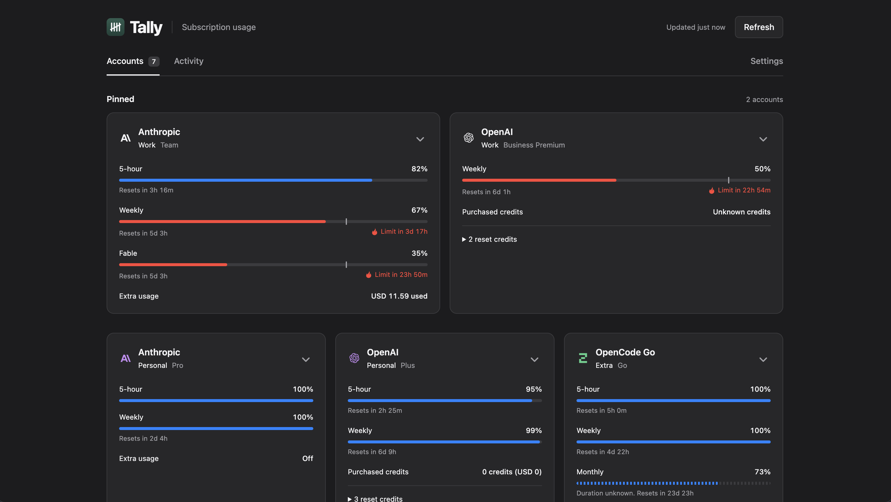
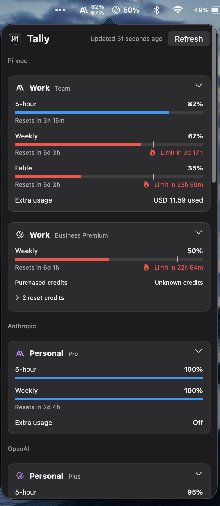
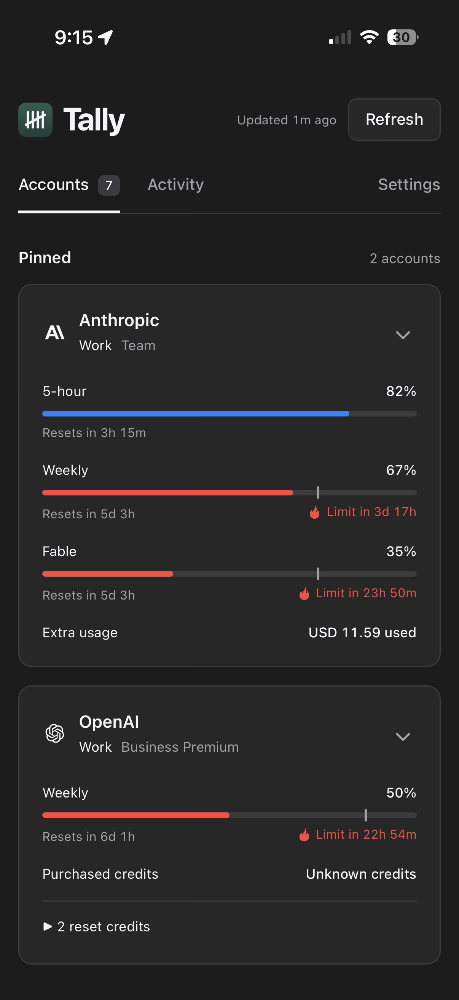

<div align="center">


# Tally

**Know how much of your AI subscriptions you have left, before you run out.**

Tally is a macOS menu bar app that tracks your Anthropic, OpenAI, OpenCode Go, and xAI subscription usage. It reads the accounts you already signed into in OpenCode, polls each provider for your current quota windows, and shows what is left and when it resets.

</div>



| Menu bar | iPhone |
| :---: | :---: |
|  |  |

## Install

You need an Apple Silicon Mac on macOS 26 or newer, and [OpenCode](https://opencode.ai) with at least one subscription account signed in.

1. Download `Tally-v0.1.0-macos-arm64.zip` from the [latest release](https://github.com/MaxAnderson95/tally/releases/latest).
2. Unzip it and drag `Tally.app` into `~/Applications` or `/Applications`.
3. Open it. The app is signed ad-hoc rather than notarized, so macOS may block the first launch. If it does, go to System Settings > Privacy & Security and click **Open Anyway**.

Tally picks up your accounts on first launch and registers itself to start at login. Nothing else to configure.

Prefer to build it yourself? See [docs/INSTALLATION.md](docs/INSTALLATION.md).

## How it works

Click the menu bar glyph to open the popover. Tally refreshes on launch, on wake, and every two minutes. The **Refresh** button pulls on demand.

**Your credentials stay in OpenCode.** Tally opens OpenCode's local database read-only and never creates, modifies, or refreshes anything in it. It stores no credentials of its own, and OpenCode does not need to be running. Sign in, rename accounts, and manage auth in OpenCode as usual.

**Quota bars turn red when you are burning too fast.** A blue bar means your current pace fits inside the window. Red means your average usage projects that you will hit the limit before the window resets, and Tally shows how long you have. The small tick mark is the even-pace marker: where you would be if you spread the window evenly.

**Pin what you care about.** Pinned accounts appear at the top and their percentages show directly in the menu bar. Everything else groups by provider below. Reorder accounts in Settings, and click an account's icon to change its color.

**The Activity tab counts what you actually spent.** Today, yesterday, or the last 30 days of recorded OpenCode tokens and cost, broken down by provider and model, with a 30-day trend. Tally also estimates what the same activity would have cost at API rates, which is separate from what your subscription charged you.

Anthropic extra usage, OpenAI purchased credits, and banked reset credits show on the account cards. Redeeming a reset always needs an explicit confirmation from you.

## On your phone

Tally serves the same interface at `http://127.0.0.1:7483`. To reach it from your phone, point a personal [Tailscale](https://tailscale.com) HTTPS proxy at that port, add the exact HTTPS origin under Settings, then open it in Safari and choose Share > Add to Home Screen.

The web app follows your phone's appearance and safe areas, and shows a reconnect screen when the Mac is unreachable. Tally does not configure Tailscale for you, and no tailnet exposure is needed for local use. Never put this API on the public internet.

## For agents

Tally has a REST API under `/api/v1` on the same port, covering status, accounts, activity, refresh, and reset redemptions. Local clients need no token; requests are limited to loopback and the one HTTPS origin you configure.

Give your coding agent the ability to check your usage:

```sh
npx skills add MaxAnderson95/tally
```

There is also an [OpenCode companion plugin](companion/README.md) that registers a single `tally` tool for the same queries.

## More

- [Installation, updates, and building from source](docs/INSTALLATION.md)
- [Provider research](docs/RESEARCH.md)
- [Architecture decisions](docs/adr) and [verification notes](docs/verification)
